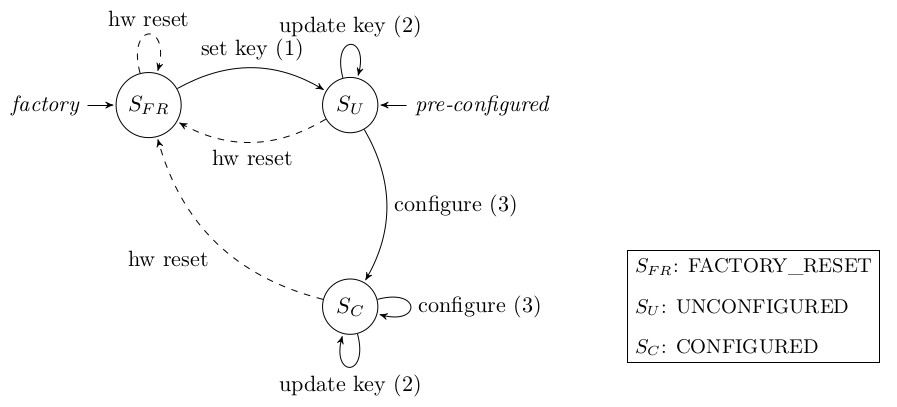

# Overview
<!-- .slide: class="center" -->

### Recap: Goal of this thesis

* Employ **NFC** to set up new smart home devices with one's smartphone.
* Develop a protocol to *securely* exchange the required data.
* Proof-of-concept implementation on *Android* and a *Raspberry Pi*.

Note:

---

# Current Progress
<!-- .slide: class="center" -->

### Protocol Design Finished

Just some minor tweaks required.

### Fancy *SecEng* Logo

Note:

---

### Device States
<!-- .slide: class="center" -->

Note:
- __Factory_reset__:
    - Blank device, no key set
- __Unconfigured__:
    - Secret key setup, not configured
- __Configured__:
    - Completely setup with key and configuration

### Protocol Messages
<!-- .slide: class="center" -->

1. *Key Setup* (smartphone configurator)
    * From __FACTORY_RESET__ to __UNCONFIGURED__
    * Exchange new key in plain
    * Not secured by MAC or encryption
    * Rely on short range of NFC / Only required once

Note:

### Protocol Messages
<!-- .slide: class="center" -->

2. <!-- .element: style="counter-increment: li;" --> *Key Update* (smartphone configurator)
    * Securely update the key
    * Encrypted and MAC-ed with the old key
    * Challenge-Response: Encrypted nonce against replay

Note:

### Protocol Messages
<!-- .slide: class="center" -->

3. <!-- .element: style="counter-increment: li 2;" --> *Device Configuration* (smartphone configurator)
    * Securely exchange credentials and configuration values
    * Encrypted and MAC-ed with the device specific key
    * Challenge-Response: Encrypted nonce against replay

Note:

### Encryption
<!-- .slide: class="center" -->

- __PRESENT__ in *CTR* mode
    - Many implementations available

### Message Authetication Code
<!-- .element: class="fragment" data-fragment-index="1" -->

- <!-- .element: class="fragment" data-fragment-index="1" --> __CMAC__ with *PRESENT*
    - Improved CBC-MAC

Note:

---

# Next Steps
<!-- .slide: class="center" -->

### Todo
* Implement protocol wrapper for *Android* and *Dummy*
    - Easily build protocol messages
    - Encryption and MAC primitves
* Update and extend code documentation

Note:

