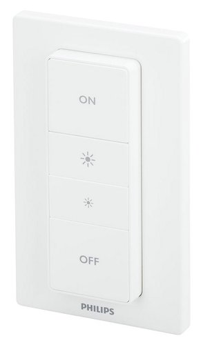
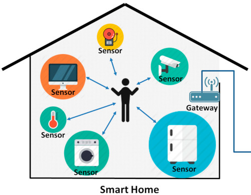
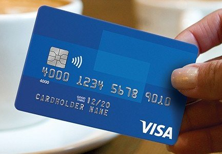
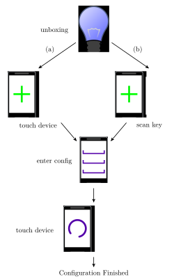

# Overview

## Structure

1. Existing Setup methods and their shortcommings
2. <!-- .element: class="fragment" -->What is *Near-Field Communication (NFC)*? Why use it?
3. <!-- .element: class="fragment" -->The Secure Smart Home Setup Protocol
4. <!-- .element: class="fragment" -->A sample implementation

Note:

* Short overview about the different topics
* After that, we will have about 5 minutes for questions

---

# Motivation

### Smart Home and its devices

* Contains multiple controllers and sensors
    * *e.g. light-switches, power-sockets, cameras, temperature sensors*
* Wirelessly connected to a root controller

<!-- .element: style="width: 16%;" -->

<!-- .element: style="width: 35%; margin-left: 10%" -->

<!-- .element: style="height: 5%;" -->

Note:

* Connect different devices in the home together
* ‘Intelligent’ home automation
    * Automatically switch on the light, when you arrive at home
    * Close the blinds, after the sun has set

### Smart Home and its devices
<!-- .slide: class="center" -->
* Wide ranges of hardware:
    * passively powered 8-bit μ-controller
    * battery powered 32-bit ARM SoC with wireless chips

Note:

* Ultra-low power in light-switches, passively powered
* More powerful in power-sockets

### Common problems
<!-- .slide: class="center" -->

* Fixed default keys (*ZigBee*) or weak encryption
* Difficult setup and pairing process from user-perspective
* <!-- .element: class="fragment" -->Insufficiently secured Wi-Fi Hotspots or Bluetooth pairing
    * Wider attack surface (long range, default keys)
    * Choose correct device from a list when pairing

Note:

* e.g. *ZigBee Light Link Profile* used a known fixed key when joining
* Especially cheap chinese stuff may not come with encryption at all

---

# What is Near-Field Communication?
<!-- .slide: class="center" -->

### Near-Field Communication (NFC)

<!-- .element: style="float: right; width: 20%;" -->

* Short ranged (about 4 to 10 cm)
* Multiple standards to improve interoparability of RFID devices
* Most commonly used in ticketing and payment applications
    * *e.g. RUB Mensa-Card, VISA payWave, Apple and Google Pay*

<!-- .element: style="width: 80%;" -->

Note:

* RUB card: Public transport ticket, ‘Mensa-Card’, access to the car-park
* Payment via NFC Credit-Cards (e.g. Visa) or Smart Phones (Apple and Google Pay)

### Near-Field Communication (NFC)
<!-- .slide: class="center" -->

* Active and Passive modes of operation
    * Passive cards with no power supply
* Tranfer rate of \\(106~\\text{kbit/s}\\)
* Complements existing wireless protocols
    * *e.g. bootstrapping Wi-Fi or Bluetooth connections*

Note:

* Passive for credit cards, take power from active RF-field
* Android Beam uses NFC to bootstrap BT file-transfer
* Bluetooth speaker setup with NFC

### Security Properties
<!-- .slide: class="center" -->

* Harder to eavesdrop than long range connections (e.g. Wi-Fi or Bluetooth)
    * ~10m in active mode, given a sufficiently large antenna
* <!-- .element: class="fragment" -->Physical proximity required
    * Man-in-the-Middle hard to conduct and easy to detect
* <!-- .element: class="fragment" -->Relay-Attacks most likely to succeed
    * __Don't send data without explicit user interaction!__

Note:

* Attacker with such contraption most likely looks suspicious
* MitM requires sender
    * Active peer can detect this relayed signal
* User Interaction required
    * Touching the peer
    * Smartphones have to be unlocked (no response in pocket)

### The NFC Data Exchange Format (NDEF)
<!-- .slide: class="center" -->

* Standardized format for storing and exchanging messages via NFC
* Has size-efficiency in mind
* Common payload types (*Well-Known*) or custom types (*External*)

Note:

* NFC with 106 kbit/s
* Low-cost tags only store a few hundred Bytes

---

# The Secure Smart Home Setup Protocol

### Abstract Overview

<!-- .element: style="float: left;" -->

1. User unboxes the device
2. <!-- .element: class="fragment" -->Touch it with the smartphone
    * *alternatively scan a supplied key*
3. <!-- .element: class="fragment" -->Enter the configuration details
    * *e.g. network SSID and passphrase*
4. <!-- .element: class="fragment" -->Write configuration to device
5. <!-- .element: class="fragment" -->Configuration done

Note:

* Different means to get the device key
    * More on that later
* Possible configuration
    * Wi-Fi network SSID and passphrase

### The Secure Smart Home Setup Protocol

<!-- .element: style="width: 70%;" -->

* The device supports three different states
* Shipping in either *FACTORY_RESET* or *UNCONFIGURED*
    * Allows shipping with a pre-configured key

Note:

* Different messages in each state
* Pre-configured shipment is useful, see later

### The *FACTORY_RESET* state

<!-- .element: style="width: 60%;" -->

* Completely unconfigured (not-usable)
    * No secret device key set
    * No configuration issued
* *Hardware Reset* puts the device in this state

Note:

* *Hardware Reset* via a micro-switch on the device
    * Erase all configuration data and secret keys
    * Device not usable (configuration), new key has to be supplied first
    * Lost a key, sell the device

### *Key Setup* Process
<!-- .slide: class="center" -->

* Set a new (initial) device key
* No encryption yet!
    * Rely on short range of NFC communication
* *Shared key between device and configurator*

Note:

### The *UNCONFIGURED* state

<!-- .element: style="width: 60%;" -->

* Secret device key set
    * May be shipped with a pre-configured key
    * Can be securely updated by the user afterwards *(2)*
* Then configured with an encrypted configuration *(3)*

Note:

* Secret key either set by user or pre-configured by factory
* Not usable yet, but ready to be configured
* In contrast to *Key Setup*, messages are encrypted with key

### The *UNCONFIGURED* state

<!-- .element: style="width: 60%;" -->

* Shipping with a pre-configured key
    * Supply the key via a passive channel (e.g. user-manual)
    * No need to exchange an unencrypted key
    * The key can be securely updated afterwards

Note:

* Key as QR-code scanned by application
* No need for unencrypted key-exchange
* Ability to securely change pre-supplied key
    * Already exchanged a key

### The *CONFIGURED* state

<!-- .element: style="width: 60%;" -->

* Fully configured device, ready for deployment
* Device key can be securely updated *(2)*
* A previous configuration can securely been updated *(3)*

Note:

* Device in usable state, integrated into the infrastructure
* No need for a hardware reset

---

### Protocol Messages
<!-- .slide: class="center" -->

* Device is passive peer, the configurator in active mode
* NDEF Formatted (*External* type records)
* Contain a *Protocol-* and *Message Type* identifier
* <!-- .element: class="fragment" -->After a key has been set:
    * MAC over the complete message for authentication (*PRESENT-CMAC*)
    * New key and configuration is encrypted (*PRESENT-CTR*)
    * The encryption counter-nonce is send
    * Freshness guaranteed by challenge-response nonce

Note:

* Device passive: Allow for low-power devices
    * e.g. light-switch
* Protocol: Identfy our messages
* Message Type: Specify the message intent
    * Capabilities, Key Setup, Key Update, Configuration
* __MAC__: Authenticity of message, shared key
* __ENC__: Confidential data (keys, passphrases) are secured
* *PRESENT* is well established light-weight cipher
    * Many free, small and fast implementations available (μController)
* Challenge newly chosen with each transmission

### Security Properties
<!-- .slide: class="center" -->

* Initial key transmission critical
    * Only secured by the short-range of NFC
    * User has to be carefull
    * Pre-configured key skips this step
* <!-- .element: class="fragment" -->Encrypted key-update and configuration
    * Prevents simple eavesdropping
* <!-- .element: class="fragment" -->Challenge-Response for each transmission via encrypted nonce
    * Replay becomes impossible

Note:

* Warn user: Check for suspicious people in the same room
* Pre-configured key: Key never send in plain
* MitM attacks are discussed in my thesis paper
* Response with fresh nonce makes old messages invalid after the transmission

### *Configuration* Process

<!-- .element: style="width: 60%;" -->

* Securely issue a new (or updated) configuration
    * *e.g. network SSID and passphrase*

Note:

1. Device and Configurator share a key
2. Discover device
3. Ask user for config (name, pass)
4. Encrypt configuration, MAC
5. Check MAC, decrypt

---

# Sample Implementation
<!-- .slide: class="center" -->

### Sample Implementation

* Configurator Application on Android
    * Many devices with NFC hardware
    * Currently not possible on iOS
    * Written in Java with Android's NFC API
* <!-- .element: class="fragment" -->‘Dummy’ smart home device on a Raspberry Pi
    * PN532 breakout board for NFC
    * Written in C with the *libnfc* library

Note:

* iOS doesn't allow sending messages with their NFC phones

## Demo time!
<!-- .slide: class="center" -->

Note:

